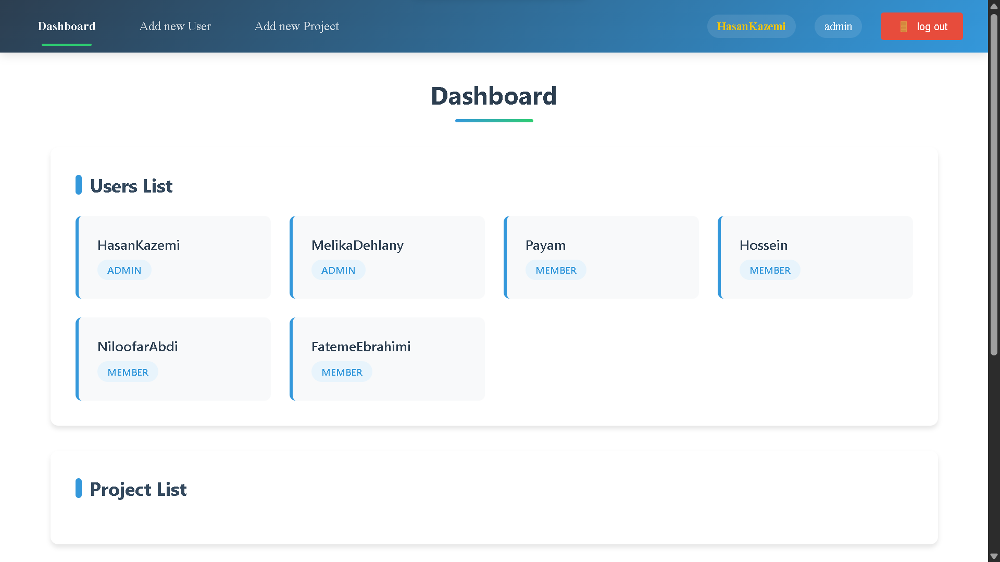
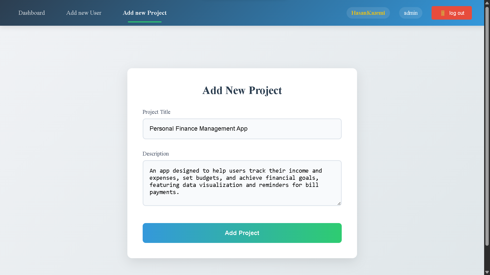
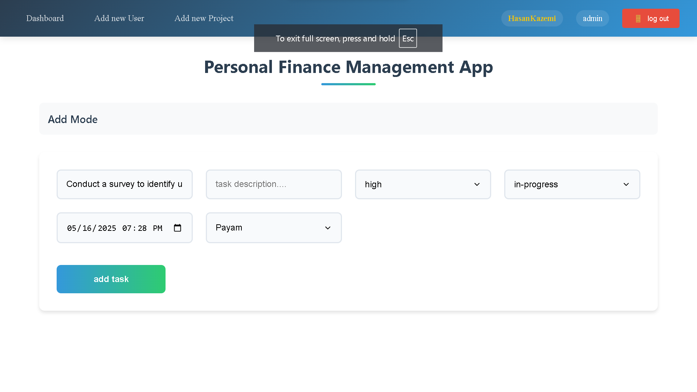
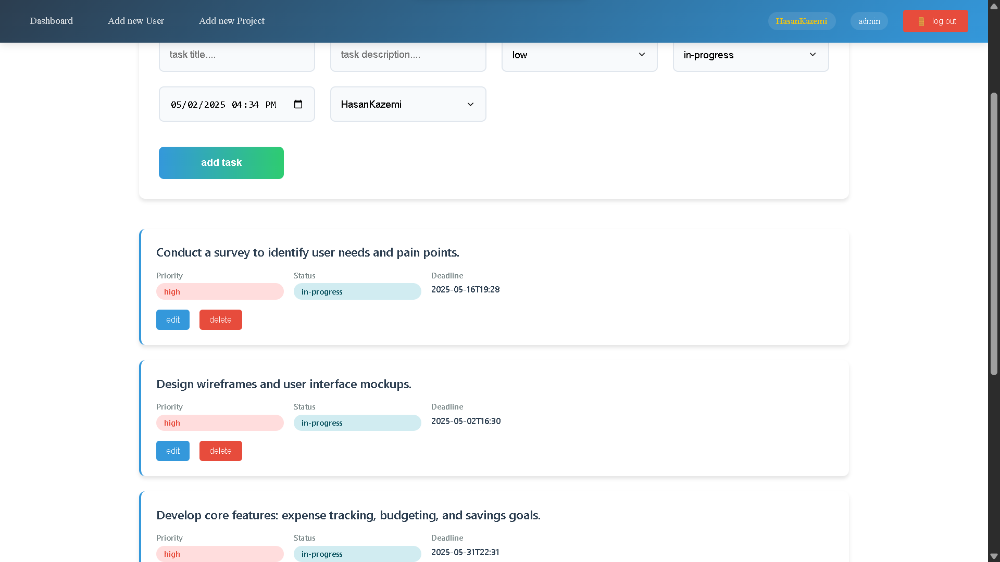
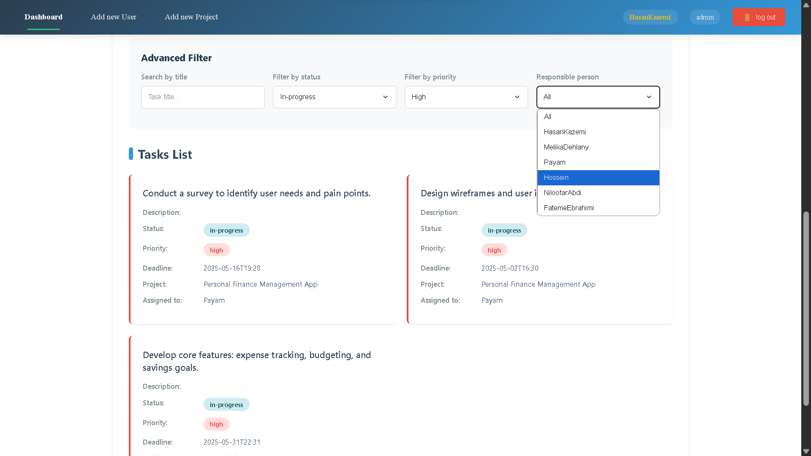
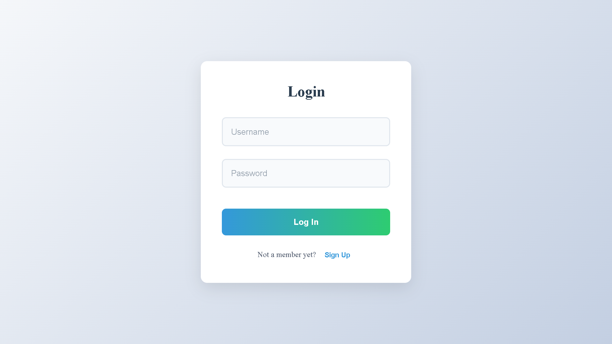

To view the demo click on the link : https://team-task-management-theta.vercel.app/

# Team Task Management

A web application for managing team tasks, projects, users, and reminders built with React, TypeScript, and Vite.

## Features

- User authentication and authorization
- Project creation and management
- Task creation, assignment, and tracking
- User management within teams
- Task reminders and notifications
- Responsive and user-friendly interface

## Technologies Used

- React with TypeScript
- Vite for build tooling and development server
- Redux Toolkit for state management
- CSS Modules for scoped styling
- ESLint for code quality and linting

## Getting Started

### Prerequisites

- Node.js (version 14 or higher)
- npm or yarn package manager

### Installation

1. Clone the repository:

   ```bash
   git clone https://github.com/HasanKazemi/Team-Task-Management
   cd Team-Task-Management
   ```

2. Install dependencies:

   ```bash
   npm install
   # or
   yarn install
   ```

### Running the Application

Start the development server:

```bash
npm run dev
# or
yarn dev
```

Open your browser and navigate to `http://localhost:5173` to see the app in action.


## Images

Admin Dashboard - display all users


Add new Projects


Add new tasks for each project


Manage tasks - edit and delete


Advance Filter tasks


Signup/login

